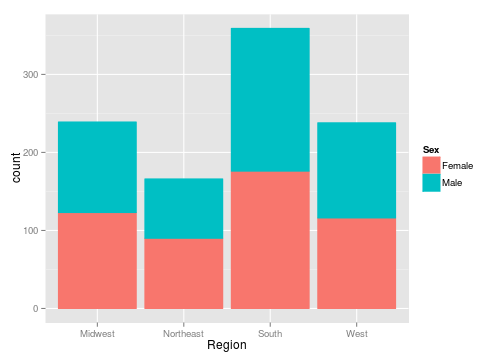
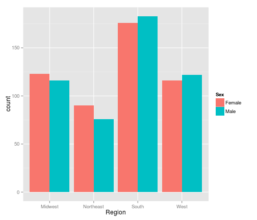
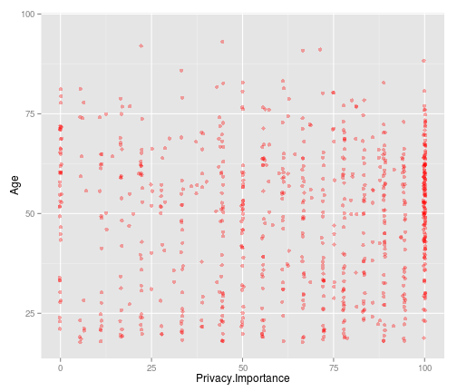
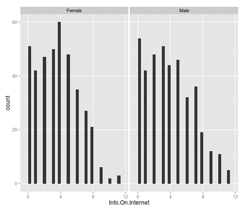
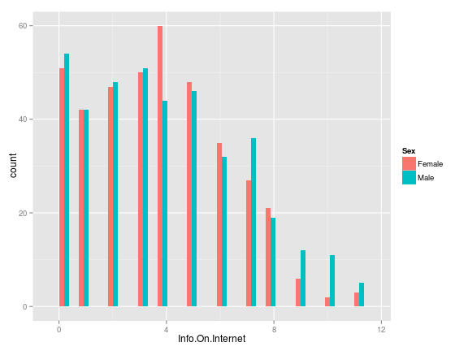
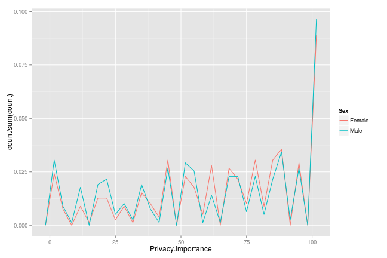
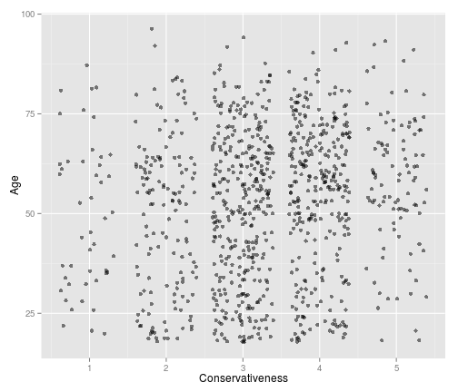
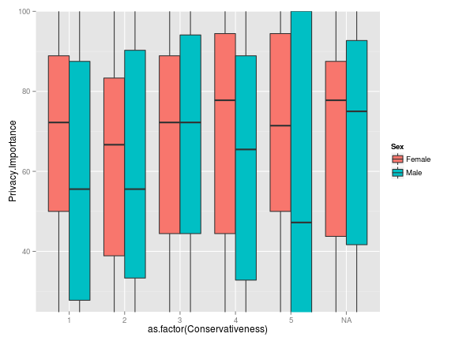
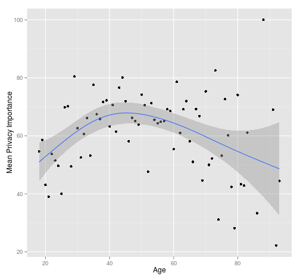
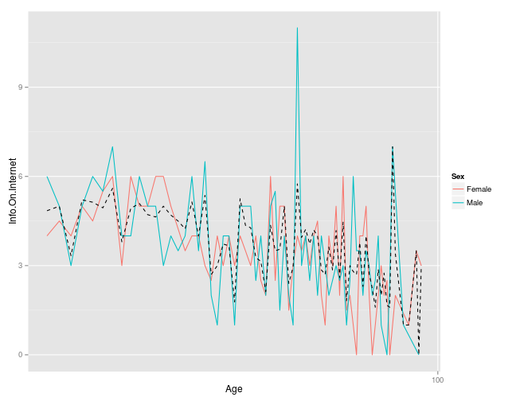

## Why do statistician and scientists make visualizations?

  - Get to know the data in order to inform meaningful statistical analysis.

  - Provide general audiences with visual summaries and insight.

  - Display results of a statistical analysis

---
## Exploratory Statistical Visualization:

- The focus of this presentation is getting to know the data in order to inform meaningful statistical analysis.

- Let's looking at the nature and the shape of the data through visualizations


---

Let's get an idea of the data by creating some exploratory visualizations. The dataset comes from a July 2013 Pew Internet and American Life Project poll. People across the United States were surveyed on their opinions about topics related to internet anonymity and privacy.

---
Let's get an idea of the demograhics of the population. A barplot is a good way to look at the factor variable of geographical region. This stacked barplot displays the of the number of respondents in each region by sex.


```r
library(ggplot2)
qplot(data = AnonymityPoll, x = Region, fill = Sex, color = Sex)
```

 

---
Let's see gender side-by-side. This barplot displays the same information in the previous plot in an slightly more useful format for comparing counts by gender.

```r
ggplot(AnonymityPoll, aes(Region, fill = Sex)) + geom_bar(position = "dodge")
```

 

---
Age may be a relevant variable in a statistical analysis. This histogram displays the distribution of respondents to the survey by age. We can see that the ages are skewed to the left with fewer respondents over the age of seventy-five.


```r
ggplot(data = AnonymityPoll, aes(x = Age)) + geom_histogram(binwidth = 1, fill = "#099DD9", 
    alpha = 0.5)
```

 


---
Let's look at the shape of the data by transforming the data on a log scale. The data pattern has become more evident and more interpretable for inferential statistics.


 


---
By examining the nature and shape of the data through this exploration, we can determine what types of statistical analysis may be useful. 

---

Scatterplot are useful in examining the relationships between two continous variables.

In the survey, respondents were asked how important internet privacy is to them. Let's find out if there is a correlation between the importance of internet privacy and age.

---
The scatterplot shows that there is not a linear relationship between privacy importance and age.

More respondents indicated that privacy is very important as indicated by the deeper color of dots in that region. But there is no correlation between age and privacy importance as the results are widely distributed across both age and degree of privacy importance.

 


---
As mentioned, barplots are useful for looking at the counts data of a single variable. Let's look at the amount of information on the internet on them in the opinion of the respondent faceted by gender. 

```r
ggplot(AnonymityPoll, aes(Info.On.Internet)) + geom_bar() + facet_wrap(~Sex)
```

 


---
We can also look at this information in another way in this dodged barplot. We see a useful comparison by gender.

```r
ggplot(AnonymityPoll, aes(Info.On.Internet, fill = Sex)) + geom_bar(position = "dodge")
```

 


---
Now, let's look more in-depth at the privacy importance. 
<br/>
The privacy importance histograms are faceted by gender. In both cases, the distributions are left-skewed with more respondents indicating that internet privacy is important.
 


---
A useful way to look at the distribution of responses is in a frequency polygon plot. Here, privacy importance is faceted by gender.

 

It appears the directions of responses are similar with slightly higher and lower counts at different degrees of privacy importance.

---
By looking at this density plot, we can see that there are more males who have less concern over privacy and more females who have given greater importance to internet privacy.

```r
ggplot(AnonymityPoll, aes(Privacy.Importance, color = Sex)) + geom_density()
```

 


---
Let's look at the same variables in a boxplot which is a good way to visualize continuous and categorical variables. The interquartile range for males is wider and females have a higher median value for privacy importance. This is consistent with the findings we saw in the frequency polygons.

 


---
Let's look at the relationship between some of the other demographic data including age and conservativeness. The plot shows that there is not a linear relationship. The deeper colored dots indicate that most respondents neither very conservative or very liberal. Furthermore, this data is spread across all age groups.

 


---
This boxplot gives an excellent summary of the interquartile range and median of privacy importance by level of conservativeness faceted by gender. Males have a wider range of privacy importance and lower median importance at all levels of conservativeness. There is no clear correlation between conservativeness and privacy importance as the responses.

 


---
Great! We have seen a lot of useful visualization to inform our statistical analysis.

We've learned that there may not be correlations or relationships between variables.

We may even design a new study that asks different questions.

---
Summarizing data also informs meaningful statistical analysis. Let's look the mean and the median of privacy importance summarized by age.

```
## Source: local data frame [6 x 4]
## 
##   Age privacyimp_mean privacyimp_median  n
## 1  18           54.63             52.78 13
## 2  19           58.57             66.67 16
## 3  20           43.06             38.89 12
## 4  21           38.99             27.78 14
## 5  22           53.75             50.00 16
## 6  23           51.47             47.22 19
```


---
The plot of the privacy importance mean by age indicates a general n-shaped curve. Our previous histogram of the age distribution is coming in handy. Remember that there are more respondents in younger age groups and fewer respondents over seventy-five. Thus,it may also be useful to look at the median privacy mean by age.

 


---
The median privacy mean by age also indicates an n-shaped curve with slightly more dispersion. Privacy importance is less important at ages under twenty-five and ages of seventy-five. If few people over the age of seventy-five use the internet then internet privacy may less of a concern to them. Notice the wider bands in the older values for age where there are fewer respondents in the survey.

 

---
Previously, I summarized the data on one variable of age. Now let's look at the data summarized by two variables,age and gender. Each unique combination of age and gender is represented.

```
## Source: local data frame [6 x 5]
## 
##   Age    Sex bprivacyimp_mean bprivacyimp_median bn
## 1  18 Female            37.04              44.44  3
## 2  18   Male            60.49              66.67 10
## 3  19 Female            51.06              63.89  6
## 4  19   Male            63.58              66.67 10
## 5  20 Female            61.11              72.22  3
## 6  20   Male            37.04              33.33  9
```


---
Let's plot information on the internet by a log transformation of age. It shows a general decreasing trend with increasing age and a higher degree of variablity for males at some age points. The grand mean is the black plotted line.

 

---
Let's look at the info on the internet by age plotted using a smoother faceted by age. This also shows the decreasing trend  of info on the internet decreasing as age increases nicely de-lineated by gender.

 


---
## We've only just begun!
  - These exploratory visualizations have only just scratched the surface of the plots and variables a statistician or scientist may want to look at in this analysis and we've already have gained a lot of meaning from the data.
  - This is all before even beginning the statistical modeling process.
  - The insight gained through visualizations helps inform the next steps of the data science process. 
  - Hopefully, this has given you an idea of the visualization process from a statistician's or data scientist's perspective.
  
  


---

## We have learned a lot about our data by doing some smart visualizations. 
  - distribution of variables, 
  - shape of the data
  - relationships between variables
  - visualization of frequencies
  - correlations
  - faceting data on a third variable 
  - usefulness of looking at the same information in a variety of plots
  - data transformations including log and smoothing

---
Thank You


